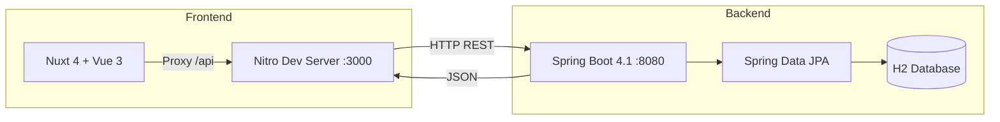

<div align="center">

# 🔗 NexoEstoque

**Sistema de Gestão de Estoque Corporativo**

Plataforma completa para controle de inventário, movimentações de entrada/saída e análise de lucratividade por produto.


</div>

---

## 📋 Sobre o Projeto

O **NexoEstoque** é um sistema full-stack de gestão de estoque. A aplicação permite o gerenciamento completo de produtos, o registro de movimentações de entrada e saída, e oferece consultas analíticas como ranking de lucratividade e visão consolidada por tipo de produto.

O sistema foi projetado com foco em **separação de responsabilidades**, **tipagem estrita** e **experiência de usuário** moderna e responsiva.

---

## 🏗️ Arquitetura da Solução



| Camada      | Tecnologia                  | Responsabilidade                          |
|-------------|-----------------------------|-------------------------------------------|
| **Frontend**| Nuxt 4, Vue 3, Nuxt UI 4    | Interface do usuário, estado e navegação   |
| **Backend** | Spring Boot 4.1, JPA        | API REST, regras de negócio, persistência  |
| **Banco**   | H2 (in-memory)              | Armazenamento de dados em desenvolvimento  |
| **Docs API**| SpringDoc OpenAPI 3          | Documentação interativa Swagger UI         |

---


## ✅ Funcionalidades Implementadas

### Cadastro de Produtos (CRUD)
- Criar, visualizar, editar e excluir produtos.
- Campos: nome, descrição, tipo (Eletrônico, Eletrodoméstico, Móvel), valor do fornecedor e quantidade em estoque.
- Validação completa via Bean Validation no backend e Zod no frontend.

### Movimentações de Estoque
- Registro de **entradas** (soma ao estoque) e **saídas** (subtrai do estoque).
- Validação de estoque insuficiente com mensagem específica e HTTP 422.
- Histórico paginado e ordenável por data.

### Consultas Analíticas
- **Por Tipo de Produto**: quantidade de produtos, estoque disponível e total de saídas por tipo.
- **Ranking de Lucro**: lucro unitário, lucro total acumulado e valor médio de venda por produto.

### Dashboard
- Visão geral com cards estatísticos (total de produtos, movimentações recentes, estoque baixo).
- Tabelas resumidas com os produtos em alerta e últimas movimentações.

---

## 📐 Regras de Negócio

| Regra | Descrição |
|-------|-----------|
| **Estoque Insuficiente** | Saídas são bloqueadas quando `quantidade solicitada > estoque disponível`. Retorna HTTP 422 com mensagem descritiva. |
| **Atualização Automática** | Cada movimentação registrada atualiza automaticamente o campo `quantidadeEstoque` do produto. |
| **Cálculo de Lucro** | `Lucro = (Valor de Venda − Valor do Fornecedor) × Quantidade Vendida`. Calculado via JPQL no banco. |
| **Tipos de Produto** | Enum fixo: `ELETRONICO`, `ELETRODOMESTICO`, `MOVEL`. |
| **Tipos de Movimentação** | Enum fixo: `ENTRADA`, `SAIDA`. |

---

## 🚀 Como Executar

### Pré-requisitos

| Ferramenta   | Versão Mínima |
|--------------|---------------|
| **Java JDK** | 21            |
| **Maven**    | 3.9+          |
| **Node.js**  | 22+           |
| **pnpm**     | 9+            |

### 1. Clonar o repositório

```bash
git clone https://github.com/mariana-reis/NexoEstoque.git
cd nexoestoque
```

### 2. Iniciar o Backend

```bash
cd estoque-api
./mvnw spring-boot:run
```

> O servidor inicia em `http://localhost:8080`.
> O banco H2 é criado automaticamente em memória com dados de exemplo.
> Swagger UI disponível em `http://localhost:8080/swagger-ui.html`.

### 3. Iniciar o Frontend

```bash
cd estoque-frontend
pnpm install
pnpm dev
```

> A aplicação inicia em `http://localhost:3000`.
> As chamadas para `/api/*` são redirecionadas automaticamente ao backend via proxy Nitro.

---

## 📖 Documentação Detalhada

| Módulo     | Link                                          |
|------------|-----------------------------------------------|
| **Backend**  | [estoque-api/README.md](./estoque-api/README.md)       |
| **Frontend** | [estoque-frontend/README.md](./estoque-frontend/README.md) |

---


<div align="center">

**NexoEstoque** · Gestão de Estoque

</div>
