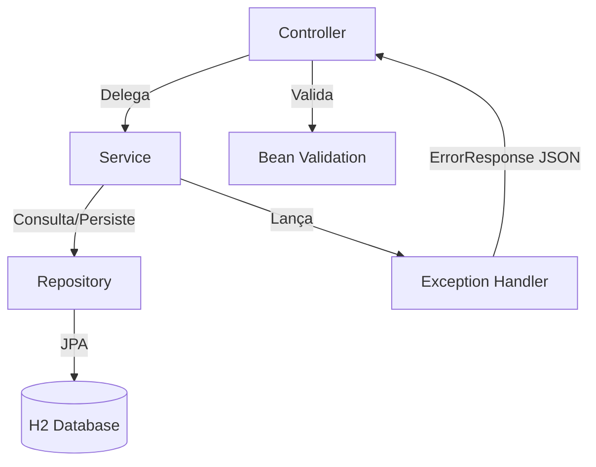
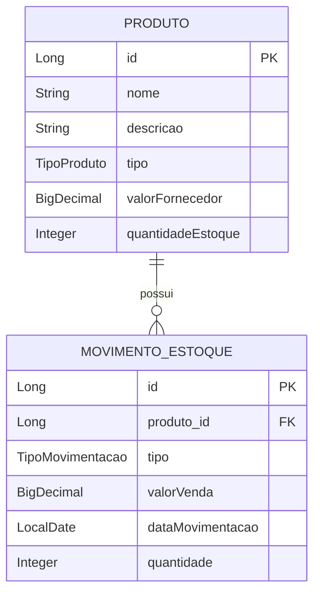

<div align="center">

# 🔗 NexoEstoque - Backend

**API REST para Gestão de Estoque**

Spring Boot 4.1 · Java 21 · H2 Database · JPA · Swagger

</div>

---

## 📋 Objetivo da API

API RESTful responsável pelo gerenciamento de produtos e movimentações de estoque. Expõe endpoints para operações CRUD de produtos, registro de entradas/saídas e consultas analíticas (por tipo de produto e ranking de lucro).

---

## 🛠️ Tecnologias Utilizadas

| Tecnologia                      | Versão  | Finalidade                                       |
|---------------------------------|---------|--------------------------------------------------|
| **Java**                        | 21      | Linguagem principal                              |
| **Spring Boot**                 | 4.1.0   | Framework web e injeção de dependências           |
| **Spring Data JPA**             | -       | ORM e acesso a dados                             |
| **Spring Validation**           | -       | Validação de campos via Bean Validation          |
| **H2 Database**                 | -       | Banco de dados relacional em memória             |
| **Lombok**                      | -       | Redução de boilerplate (getters, setters, etc.)  |
| **SpringDoc OpenAPI**           | 3.0.3   | Documentação Swagger UI                          |
| **JUnit 5 + Mockito**           | -       | Testes unitários                                 |
| **Maven**                       | 3.9+    | Gerenciador de build e dependências              |

---

## 🏗️ Arquitetura do Projeto

O backend segue uma arquitetura em camadas, com separação clara de responsabilidades:



| Camada          | Pacote                          | Responsabilidade                                    |
|-----------------|---------------------------------|-----------------------------------------------------|
| **Controller**  | `controller/`                   | Receber requisições HTTP e delegar ao Service        |
| **Service**     | `service/`                      | Regras de negócio e orquestração                     |
| **Repository**  | `repository/`                   | Acesso ao banco via Spring Data JPA                  |
| **Domain**      | `domain/`                       | Entidades JPA (Produto, MovimentoEstoque, Enums)     |
| **DTO**         | `dto/`                          | Objetos de transferência para consultas agregadas    |
| **Exception**   | `exception/`                    | Tratamento global de erros (`@RestControllerAdvice`) |

---


## 📐 Regras de Negócio

### Produto
- Nome obrigatório (máx. 100 caracteres).
- Tipo obrigatório: `ELETRONICO`, `ELETRODOMESTICO` ou `MOVEL`.
- Valor do fornecedor obrigatório e maior que zero.
- Quantidade em estoque não pode ser negativa.

### Movimentação de Estoque
- **ENTRADA**: soma a quantidade ao estoque do produto.
- **SAIDA**: subtrai a quantidade do estoque. Se `quantidade solicitada > estoque disponível`, lança `EstoqueInsuficienteException` com HTTP **422**.
- Valor de venda obrigatório (≥ 0). Para entradas, pode ser zero.
- Data da movimentação obrigatória.
- Quantidade mínima: 1 unidade.

### Cálculo de Lucro
```
Lucro Unitário = Valor Médio de Venda − Valor do Fornecedor
Lucro Total    =  (Valor de Venda − Valor do Fornecedor) × Quantidade
```

---

## 📊 Entidades e Relacionamentos



---

## 🌐 Endpoints Disponíveis

### Produtos

| Método   | Endpoint              | Descrição                                 | Status   |
|----------|-----------------------|-------------------------------------------|----------|
| `POST`   | `/produtos`           | Criar um novo produto                     | `201`    |
| `GET`    | `/produtos`           | Listar produtos (paginado)                | `200`    |
| `GET`    | `/produtos?tipo=X`    | Filtrar por tipo de produto               | `200`    |
| `GET`    | `/produtos/{id}`      | Buscar produto por ID                     | `200`    |
| `PUT`    | `/produtos/{id}`      | Atualizar produto                         | `200`    |
| `DELETE` | `/produtos/{id}`      | Remover produto                           | `204`    |
| `GET`    | `/produtos/por-tipo`  | Consulta agregada por tipo                | `200`    |

### Movimentações

| Método   | Endpoint              | Descrição                                 | Status   |
|----------|-----------------------|-------------------------------------------|----------|
| `POST`   | `/movimentos`         | Registrar entrada ou saída                | `201`    |
| `GET`    | `/movimentos`         | Listar histórico (paginado)               | `200`    |
| `GET`    | `/movimentos/{id}`    | Buscar movimentação por ID                | `200`    |
| `GET`    | `/movimentos/lucro`   | Ranking de lucro por produto              | `200`    |

### Paginação e Ordenação

Todos os endpoints de listagem suportam os parâmetros padrão do Spring Data:

```
GET /produtos?page=0&size=10&sort=nome,asc
GET /movimentos?page=0&size=10&sort=dataMovimentacao,desc
```

| Parâmetro | Descrição                  | Padrão             |
|-----------|----------------------------|---------------------|
| `page`    | Número da página (0-based) | `0`                 |
| `size`    | Itens por página           | `20`                |
| `sort`    | Campo e direção            | Definido pela query |

---

## ⚠️ Tratamento de Erros

Todas as respostas de erro seguem o formato padronizado:

```json
{
  "timestamp": "2025-07-17T20:30:00.000",
  "status": 422,
  "error": "Unprocessable Entity",
  "message": "Estoque insuficiente para o produto 'Mouse'. Disponível: 2 | Solicitado: 5",
  "path": "/movimentos",
  "details": null
}
```

| Status | Exceção                        | Cenário                              |
|--------|--------------------------------|--------------------------------------|
| `400`  | `MethodArgumentNotValidException` | Campos inválidos (validação)       |
| `404`  | `ResourceNotFoundException`    | Produto ou movimentação não encontrado |
| `422`  | `EstoqueInsuficienteException` | Saída com saldo insuficiente         |
| `500`  | `Exception` (fallback)         | Erro inesperado no servidor          |

---

## 🧪 Testes Unitários

Os testes cobrem as regras de negócio críticas usando **JUnit 5** e **Mockito**:

### ProdutoServiceTest
| Teste | Descrição |
|-------|-----------|
| `buscarPorId_Sucesso` | Retorna produto quando o ID existe |
| `buscarPorId_Falha` | Lança `ResourceNotFoundException` para ID inexistente |
| `salvar_Sucesso` | Persiste novo produto com sucesso |
| `atualizar_Sucesso` | Atualiza campos do produto existente |
| `deletar_Sucesso` | Remove produto por ID |
| `deletar_Falha` | Lança exceção para ID inexistente |

### MovimentoServiceTest
| Teste | Descrição |
|-------|-----------|
| `registrarEntrada_Sucesso` | Registra entrada e soma ao estoque |
| `registrarSaida_Sucesso` | Registra saída e subtrai do estoque |
| `registrarSaida_EstoqueInsuficiente` | Lança exceção quando saldo insuficiente |

**Executar testes:**

```bash
./mvnw test
```

---

## ▶️ Como Executar

### Com Maven Wrapper (recomendado)

```bash
cd estoque-api
./mvnw spring-boot:run
```

### Com Maven instalado

```bash
cd estoque-api
mvn spring-boot:run
```

> A API inicia em `http://localhost:8080`.

---

## 🗄️ Banco de Dados H2

O banco H2 é criado automaticamente em memória ao iniciar a aplicação. Os dados de exemplo são carregados via `data.sql`.

| Propriedade          | Valor                                |
|----------------------|--------------------------------------|
| **Console H2**       | `http://localhost:8080/h2-console`   |
| **JDBC URL**         | `jdbc:h2:mem:testdb`                 |
| **Usuário**          | `sa`                                 |
| **Senha**            | *(vazio)*                            |

> ⚠️ Os dados são perdidos ao reiniciar a aplicação (banco em memória).

---

## 📑 Swagger / OpenAPI

A documentação interativa está disponível em:

| Recurso          | URL                                        |
|------------------|--------------------------------------------|
| **Swagger UI**   | `http://localhost:8080/swagger-ui.html`     |
| **OpenAPI JSON** | `http://localhost:8080/v3/api-docs`         |

> Em ambiente de produção (`profile=prod`), o Swagger é automaticamente desabilitado.

---

## 📦 Exemplos de Requisição e Resposta

### Criar Produto

```bash
curl -X POST http://localhost:8080/produtos \
  -H "Content-Type: application/json" \
  -d '{
    "nome": "Notebook Dell",
    "descricao": "Intel i7, 16GB RAM",
    "tipo": "ELETRONICO",
    "valorFornecedor": 4200.00,
    "quantidadeEstoque": 10
  }'
```

**Resposta (201 Created):**
```json
{
  "id": 1,
  "nome": "Notebook Dell",
  "descricao": "Intel i7, 16GB RAM",
  "tipo": "ELETRONICO",
  "valorFornecedor": 4200.00,
  "quantidadeEstoque": 10
}
```

### Registrar Saída

```bash
curl -X POST http://localhost:8080/movimentos \
  -H "Content-Type: application/json" \
  -d '{
    "produto": { "id": 1 },
    "tipo": "SAIDA",
    "valorVenda": 5500.00,
    "dataMovimentacao": "2025-07-17",
    "quantidade": 2
  }'
```

### Consultar Lucro por Produto

```bash
curl http://localhost:8080/movimentos/lucro
```

**Resposta (200 OK):**
```json
[
  {
    "produtoId": 1,
    "nomeProduto": "Notebook Dell XPS 15",
    "totalSaida": 2,
    "valorFornecedor": 4200.00,
    "valorMedioVenda": 5500.00,
    "lucroUnitario": 1300.00,
    "lucroTotal": 2600.00
  }
]
```

---

## 🧩 Decisões Técnicas

| Decisão | Justificativa |
|---------|---------------|
| **Java Records para DTOs** | Imutabilidade, código enxuto e sem boilerplate. |
| **`open-in-view: false`** | Evita lazy loading fora de transações, prevenindo `LazyInitializationException`. |
| **`JOIN FETCH` + `countQuery`** | Solução explícita para carregar `Produto` em consultas paginadas de movimentações, evitando conflitos do Hibernate com `@EntityGraph`. |
| **`@Transactional` nos Services** | Garante atomicidade: se qualquer etapa falhar, toda a operação é revertida. |
| **`@RestControllerAdvice` global** | Centraliza o tratamento de erros em um único ponto, mantendo os controllers limpos. |
| **HTTP 422 para estoque insuficiente** | Diferencia de erros de validação (400). A requisição é válida sintaticamente, mas não pode ser processada pela regra de negócio. |
| **`data.sql` com seed** | Permite demonstrar o sistema imediatamente sem cadastros manuais. |

---

<div align="center">

[← Voltar ao README principal](../README.md) · [Frontend →](../estoque-frontend/README.md)

</div>
