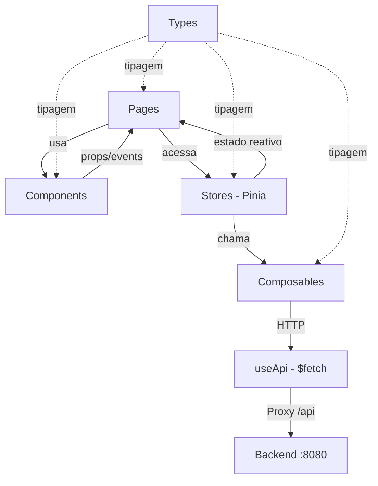
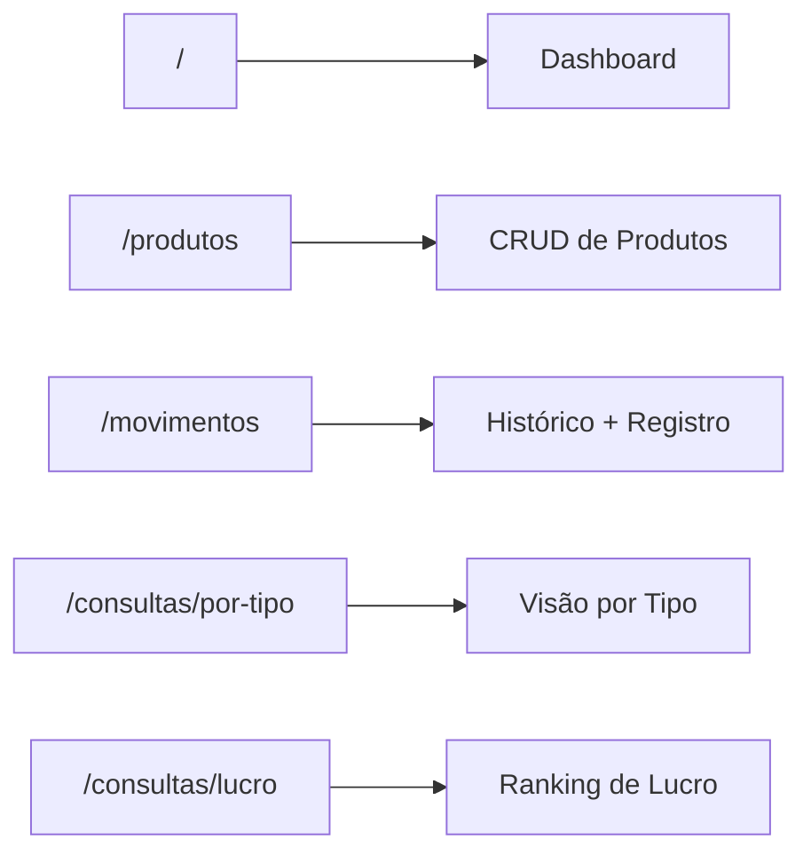

<div align="center">

# 🔗 NexoEstoque - Frontend

**Interface de Gestão de Estoque**

Nuxt 4 · Vue 3 · Nuxt UI 4 · TypeScript · Pinia · TailwindCSS 4

</div>

---

## 📋 Descrição do Projeto

Interface web moderna e responsiva para o sistema **NexoEstoque**. Desenvolvida com Nuxt 4 e Vue 3 Composition API, oferece uma experiência fluida para gerenciamento de produtos, registro de movimentações de estoque e visualização de relatórios analíticos de lucratividade.

---

## 🛠️ Tecnologias Utilizadas

| Tecnologia         | Versão  | Finalidade                                        |
|--------------------|---------|---------------------------------------------------|
| **Nuxt**           | 4.4+    | Framework full-stack com SSR e roteamento automático |
| **Vue.js**         | 3.5+    | Reatividade e componentes (Composition API)       |
| **Nuxt UI**        | 4.9+    | Biblioteca de componentes UI (UTable, UModal, etc.) |
| **TypeScript**     | 5+      | Tipagem estrita em toda a aplicação               |
| **Pinia**          | 2.3+    | Gerenciamento de estado global                    |
| **TailwindCSS**    | 4.3+    | Estilização utility-first                         |
| **Zod**            | 3.22+   | Validação de schemas no frontend                  |
| **pnpm**           | 9+      | Gerenciador de pacotes                            |

---

## 🏗️ Arquitetura do Frontend



O frontend segue uma arquitetura em camadas bem definida:

| Camada          | Diretório        | Responsabilidade                                          |
|-----------------|------------------|-----------------------------------------------------------|
| **Pages**       | `pages/`         | Rotas da aplicação, orquestram componentes e stores        |
| **Components**  | `components/`    | Elementos reutilizáveis de UI (formulários, tabelas, cards)|
| **Stores**      | `stores/`        | Estado global compartilhado via Pinia                      |
| **Composables** | `composables/`   | Hooks de integração HTTP com a API REST                    |
| **Types**       | `types/`         | Interfaces e tipos TypeScript                              |
| **Utils**       | `utils/`         | Funções auxiliares (formatação de moeda, números)          |

---


## 🎨 Design System

### Componentes Nuxt UI 4

A aplicação utiliza exclusivamente componentes do **Nuxt UI 4**:

| Componente      | Uso                                              |
|-----------------|--------------------------------------------------|
| `UTable`        | Tabelas de dados paginadas                       |
| `UModal`        | Modais para formulários de criação/edição        |
| `UForm`         | Container de formulário com validação Zod         |
| `UFormField`    | Campo de formulário com label e erro             |
| `UInput`        | Campos de texto e número                         |
| `USelect`       | Seleção de opções (produto, tipo)                |
| `UButton`       | Botões com variantes e ícones                    |
| `UBadge`        | Indicadores visuais de tipo e status             |
| `UCard`         | Containers com sombra e divisores                |
| `UIcon`         | Ícones do pacote Lucide                          |
| `UDropdownMenu` | Menus de ações contextuais                       |
| `UToast`        | Notificações de sucesso e erro                   |

### Paleta de Cores

| Cor        | Uso                                           |
|------------|-----------------------------------------------|
| `primary`  | Ações principais, links e destaques           |
| `success`  | Entradas de estoque, operações bem-sucedidas  |
| `warning`  | Alertas de estoque baixo                      |
| `error`    | Saídas de estoque, erros e exclusão           |
| `info`     | Informações complementares                    |
| `neutral`  | Botões secundários e cancelamento             |

### Tema Escuro

Alternância manual via botão no cabeçalho usando `useColorMode()` do Nuxt. Todos os componentes adaptam-se automaticamente com classes `dark:`.

---

## 🔌 Integração com a API

### Proxy de Desenvolvimento

As chamadas à API passam por um proxy configurado no Nitro, eliminando problemas de CORS:

```typescript
// nuxt.config.ts
nitro: {
  devProxy: {
    '/api': {
      target: 'http://localhost:8080',
      changeOrigin: true,
    }
  }
}
```

### Composables de Integração

| Composable       | Descrição                                              |
|------------------|--------------------------------------------------------|
| `useApi()`       | Wrapper do `$fetch` com interceptação de erros e toast |
| `useProdutos()`  | CRUD de produtos + consulta por tipo                   |
| `useMovimentos()`| Registro de movimentações + consulta de lucro          |

O `useApi()` intercepta automaticamente qualquer erro HTTP e exibe uma notificação visual (toast), centralizando o tratamento de erros.

---

## 📦 Gerenciamento de Estado

O estado global é gerenciado com **Pinia** via dois stores:

### `useProdutoStore`

| Propriedade        | Tipo                 | Descrição                                |
|--------------------|----------------------|------------------------------------------|
| `produtos`         | `Produto[]`          | Lista de produtos carregados             |
| `totalElements`    | `number`             | Total para paginação                     |
| `isCarregando`     | `boolean`            | Flag de loading                          |
| `dashboardStats`   | `ConsultaTipoDTO[]`  | Dados da consulta por tipo               |
| `estoqueBaixo`     | `computed<Produto[]>`| Produtos com estoque < 5                 |

### `useMovimentoStore`

| Propriedade           | Tipo                   | Descrição                              |
|-----------------------|------------------------|----------------------------------------|
| `movimentos`          | `MovimentoEstoque[]`   | Lista de movimentações                 |
| `totalElements`       | `number`               | Total para paginação                   |
| `isCarregando`        | `boolean`              | Flag de loading                        |
| `rankingLucro`        | `LucroProdutoDTO[]`    | Ranking de lucro por produto           |
| `ultimasMovimentacoes`| `computed`             | 5 movimentações mais recentes          |
| `lucroTotalAcumulado` | `computed<number>`     | Soma de todos os lucros                |

---

## ▶️ Como Executar

### Pré-requisitos

- **Node.js** 22+
- **pnpm** 11+
- Backend rodando em `http://localhost:8080`

### Instalação e Execução

```bash
cd estoque-frontend
pnpm install
pnpm dev
```

> A aplicação inicia em `http://localhost:3000`.

### Scripts Disponíveis

| Script             | Comando            | Descrição                         |
|--------------------|--------------------|------------------------------------|
| **Desenvolvimento**| `pnpm dev`         | Inicia o servidor de desenvolvimento |
| **Build**          | `pnpm build`       | Gera build de produção             |
| **Preview**        | `pnpm preview`     | Visualiza build de produção        |
| **Generate**       | `pnpm generate`    | Gera versão estática (SSG)         |
| **Postinstall**    | `pnpm postinstall` | Prepara tipos do Nuxt              |

---

## 🗺️ Estrutura das Páginas



| Rota                  | Página                       | Funcionalidade                              |
|-----------------------|------------------------------|---------------------------------------------|
| `/`                   | Dashboard                    | Resumo geral, estoque baixo, últimas movimentações |
| `/produtos`           | Lista de Produtos            | CRUD completo com modal de criação/edição   |
| `/movimentos`         | Histórico de Movimentações   | Lista paginada + modal de registro          |
| `/consultas/por-tipo` | Consulta por Tipo            | Tabela com quantidade disponível e saídas   |
| `/consultas/lucro`    | Ranking de Lucro             | Lucro unitário e total por produto          |

---

## 📱 Responsividade

A interface é totalmente responsiva, adaptando-se a diferentes tamanhos de tela:

| Breakpoint  | Comportamento                                           |
|-------------|---------------------------------------------------------|
| **Mobile**  | Sidebar colapsada, formulários em coluna única           |
| **Tablet**  | Sidebar colapsável, grids de 2 colunas                   |
| **Desktop** | Sidebar fixa, grids de 3–4 colunas, cards lado a lado   |

Recursos de responsividade aplicados:
- Cards com `shrink-0` e `min-w-0` para evitar overflow de ícones.
- Grids com breakpoints `sm:grid-cols-2` e `lg:grid-cols-4`.
- Formulários com `flex-col-reverse` em telas pequenas para botões acessíveis.

---

## ♿ Acessibilidade

- HTML semântico.
- Atributo `lang="pt-BR"` no `<html>`.
- Labels associados a todos os campos de formulário via `UFormField`.
- Contraste adequado em modo claro e escuro.
- Ícones com roles acessíveis via Nuxt UI.
- Navegação por teclado nos componentes `UTable`, `USelect` e `UModal`.

---

## 🧩 Decisões Técnicas

| Decisão | Justificativa |
|---------|---------------|
| **Composition API (`<script setup>`)** | API moderna do Vue 3, melhor inferência de tipos e código mais conciso. |
| **Pinia em vez de Vuex** | Store oficial do Vue 3, com suporte nativo a TypeScript e Composition API. |
| **Zod para validação** | Schema-first, integração nativa com `UForm` do Nuxt UI 4. |
| **Proxy Nitro** | Elimina configuração de CORS no desenvolvimento, simula ambiente de produção. |
| **Componentes não-Pro** | Sidebar e header customizados com HTML semântico + Tailwind, sem dependência do Nuxt UI Pro. |
| **`useApi()` centralizado** | Um único ponto de interceptação de erros HTTP com toast automático. |
| **Auto-imports do Nuxt** | Composables, stores e utils são importados automaticamente sem `import` explícito. |

---

<div align="center">

[← Voltar ao README principal](../README.md) · [Backend →](../estoque-api/README.md)

</div>
